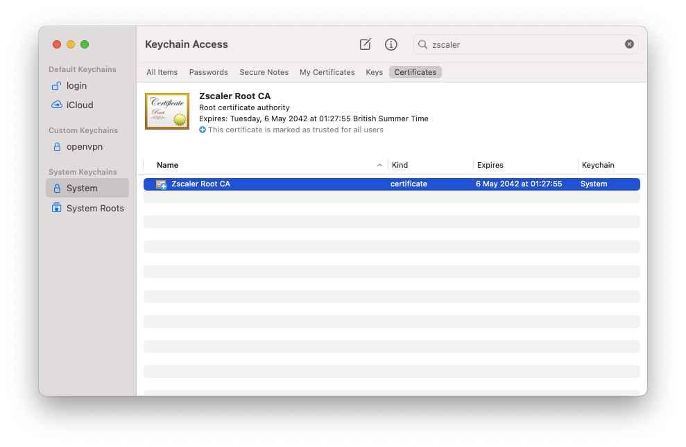

# Zscaler Root Certificate Installation Script

This Bash script automates the installation of the Zscaler root certificate on the local machine. It intelligently detects the operating system and executes the appropriate installation scripts. Additionally, it runs common installation scripts regardless of the operating system installed on the local machine.

## Prerequisites

- Bash shell
- Zscaler root certificate file (`ZscalerRootCA.pem`)

The Zscaler root certificate can be retrieved from a number of locations, for example on OSX if installed in keychain it can be exported to a PEM and saved in your home directory.



## Support

The following applications are currently supported, [contributions](./CONTRIBUTING.md) are welcome.

- OSX
  - pip
  - openssl
- Linux
- Windows

## Usage

1. Ensure that the Zscaler root certificate file (`ZscalerRootCA.pem`) is available and stored in your home directory.

2. Run the script in a Bash environment:

    ```bash
    ./install-certificate.bash
    ```

3. The script will automatically detect the operating system and execute the corresponding installation scripts.

## Script Overview

- **Strict Mode**: The script runs in strict mode (`set -euo pipefail`) to catch errors early.

- **Default Configuration**:
  - `DEFAULT_OS_SCRIPTS_DIR`: Default directory for OS-specific installation scripts.
  - `DEFAULT_PEM_FILE`: Default Zscaler PEM file name.

- **Operating System Detection**: The script determines the operating system and executes the appropriate installation scripts for Linux, macOS, and Windows.

- **Certificate Installation Function**: The `install_certificates` function locates and executes relevant installation scripts within specified directories.

- **PEM File Checking**: The `check_pem_file` function ensures the Zscaler PEM file is present; otherwise, the script exits with an error message.

## Customization

- **Home Directory (`HOME_DIR`)**: The script automatically sets the home directory based on the operating system (Windows or Unix-like).

- **PEM File Path (`DEFAULT_PEM_FILE_PATH`)**: The default path for the Zscaler PEM file is set to the user's home directory. You can customize this by modifying the script.

## Supported Operating Systems

- Linux
- macOS
- Windows (MSYS, Cygwin, or WSL)

## License

This script is provided under the [MIT License](LICENSE).
